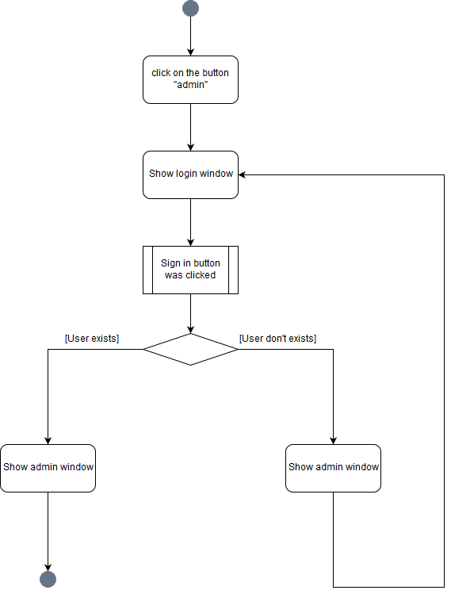
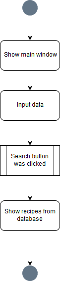
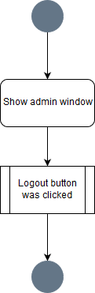
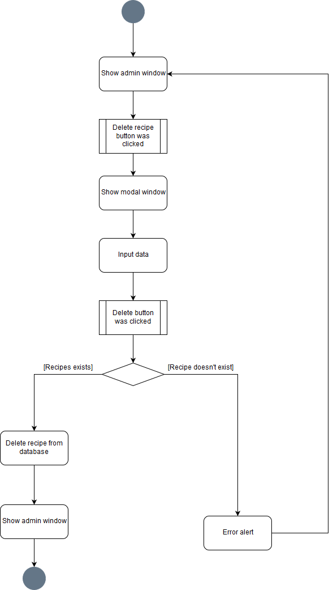

# Диаграммы активностей
---

# Содержание
1 [Авторизация](#authorization)  
2 [Поиск рецепта](#search)  
3 [Выход из учетной записи](#logout)  
4 [Удаление рецепта](#deleterecipe)

<a name="authorization"/>

# 1 Авторизация
  

<a name="search"/>

# 2 Поиск рецепта
  

<a name="logout"/>

# 3 Выход из учетной записи

<a name="deleterecipe"/>

# 4 Удаление рецепта

