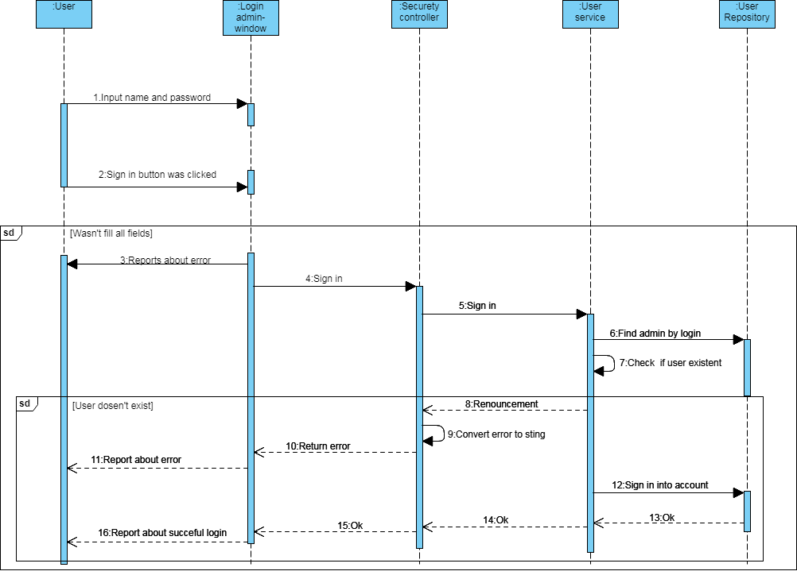
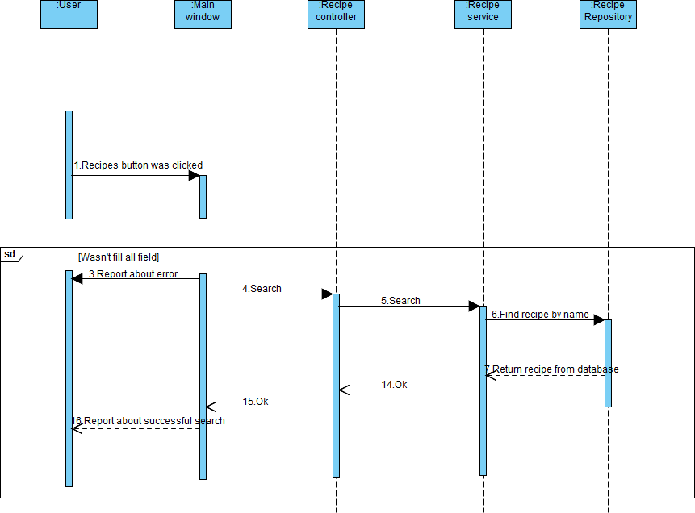
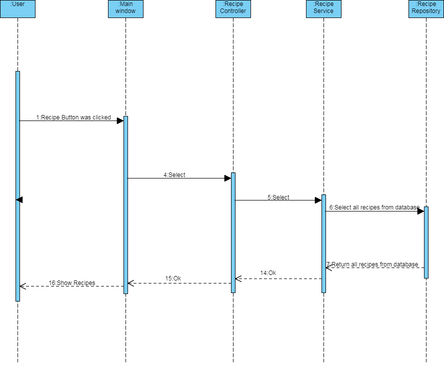
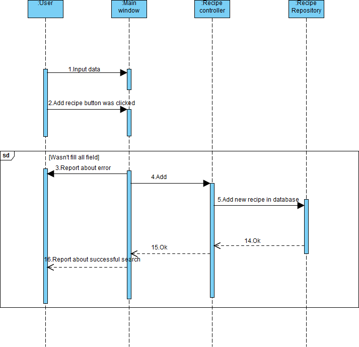

# Диаграммы последовательностей
---

# Содержание
1 [Авторизация](#auth)  
2 [Поиск рецепта](#search)  
3 [Отображение всех рецептов](#show)  
4 [Добавление рецепта](#add)

<a name="auth"/>

# 1 Авторизация

<a name="search"/>

# 2 Поиск препарата

<a name="show"/>

# 3 Отображение всех препаратов

<a name="add"/>

# 4 Добавление изменение препарата

