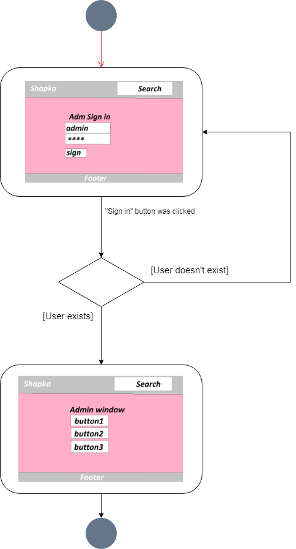
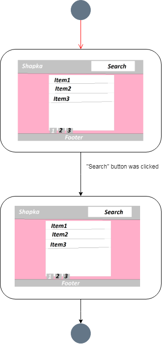
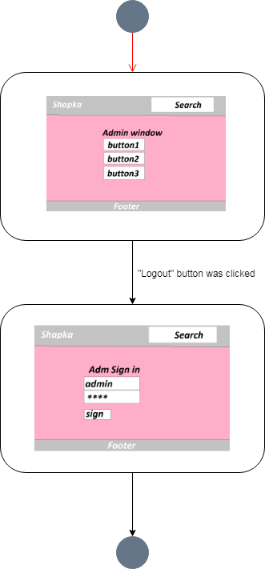
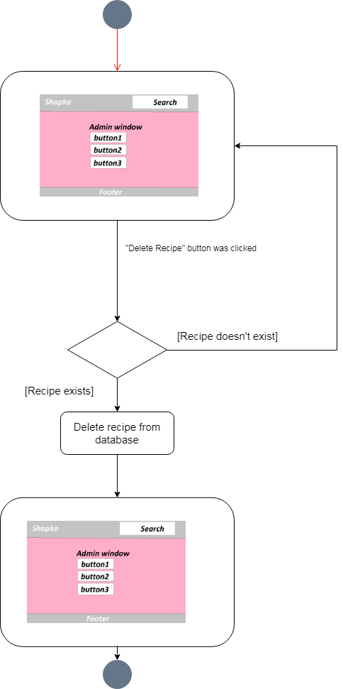
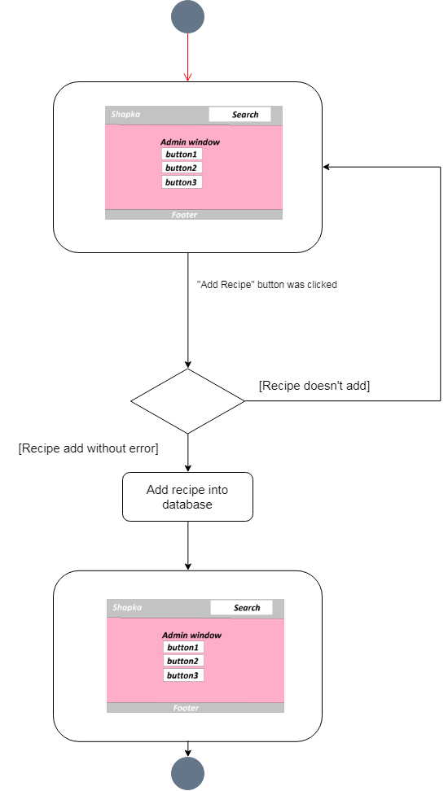
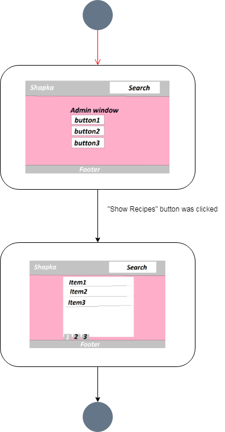

# Диаграммы состояний
---  

# Содержание
1 [Авторизация администрации](#auth)  
2 [Поиск рецепта](#search)  
3 [Выход из учетной записи](#logout)  
4 [Удаление рецепта](#delete)  
5 [Добавление рецепта](#add)  
6 [Вывод рецептов](#show)  

<a name="auth"/> 

# 1 Авторизация администрации

<a name="search"/>

# 2 Поиск рецепта

<a name="logout"/>

# 3 Выход из учетной записи

<a name="delete"/>

# 4 Удаление препарата

<a name="add"/>

# 5 Добавление рецепта

<a name="show"/>

# 6 Вывод препаратов

<a name="delete"/>

