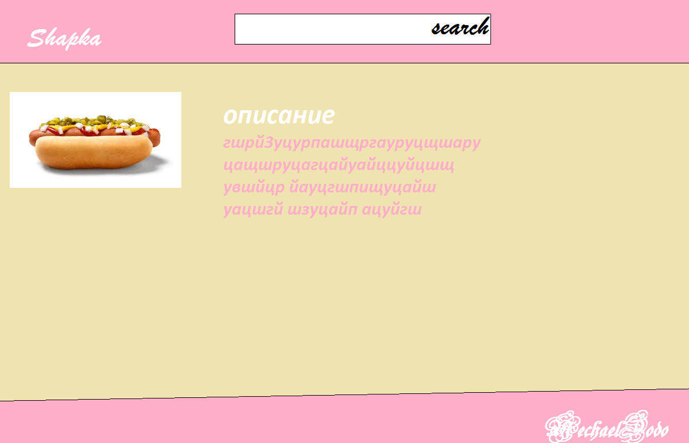

# Требования к проекту
---
 Содержание
===

# 1 Введение

В этом документе описаны функциональные и нефункциональные требования к веб-приложению «Online-recipes». Данный проект содержит необходимую функциональность для простого поиска информации для приготовления лучших блюд из разных стран. 

# 2 Требования пользователя

### 2.1 Интерфейс пользователя

- Стартовая страница
  
  
### 2.2 Характеристики пользователей

### 2.2.1 Классы пользователей
1. Гость - пользователь, который не зарегистрирован на сайте, однако может просматривать весь имеющийся список рецептов.
2. Администратор -  пользователь, который может управлять всеми данными на сайте(добавлять рецепты и т.д.).

#### 2.2.2 Целевая аудитория

 Любой человек, который хочет приготовить (иногда) простое и вкусное блюдо.  

# 3 Системные требования

## 3.1 Функциональные требования
 
 
### 3.1.1 Управление данными на сайте

#### 3.1.1.1 Добавление рецептов

 Только администратор может добавлять рецепты на сайт.
 

#### 3.1.1.2 Удаление рецептов

 Только администратор может удалять рецепты с сайта.
 
#### 3.1.1.3 Добавление рецептов в "лучшие рецепты"

 Администратор может добавить рецепт в раздел "лучшие рецепты". 
 
### 3.1.2 Вход администрации

 Пользователь при помощи определенного ключа (логин (email,определенное имя) и пароль) может войти в режиме администратора сайта.
 
### 3.1.3 Выход администрации 

 Администратор имеет возможность выйти из режима администрации.
 
### 3.1.4 Поиск по сайту

 Любой пользователь может производить поиск по названию рецепта.

## 3.2 Нефункциональные требования

#### 3.2.1 Требования к удобству использования
1. Все элементы приложения должны быть светлыми.
2. Все функциональные элементы пользовательского интерфейса имеют названия, описывающие действие, которое произойдет при выборе элемента.
3. Размер шрифта не менее 12 пт.

